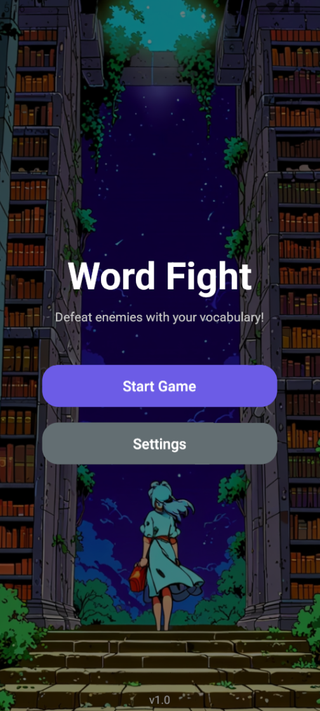
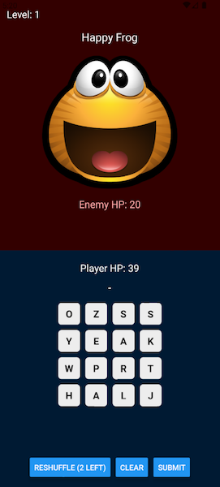
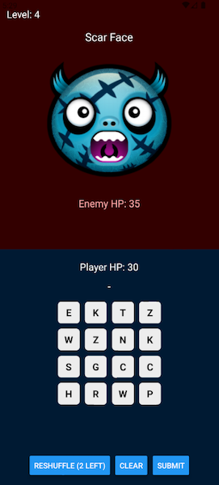

# 📚 Word Battle — A React Native Word Game

**Word Battle** is a simple but fun mobile game inspired by *Bookworm Adventures*, built with **React Native**, **Expo Router**, and **Zustand**.

Your goal: defeat enemies by forming valid words using a randomized set of 12 letters. The longer or more complex the word, the more damage you deal!

---

## 🎮 Features

- 🔤 Word-based battle system with randomized letter sets
- 🧠 Local dictionary word validation
- ⚔️ Scalable damage system based on word length and letter rarity
- 👾 Enemies get stronger with each level
- 💥 Animated floating damage effects
- 🪨 Reshuffle letters (limited to 2 per game)
- ❤️ Shake animations when HP changes
- 🧟‍♂️ Game over modal and level progression

---

## 🛠 Tech Stack

- **React Native** (with Expo)
- **Zustand** for state management
- **Expo Router** for navigation
- **Custom local dictionary** for word validation
- **Animated API** for effects

---

## 📸 Screenshots / Demo

  
  
  
  

